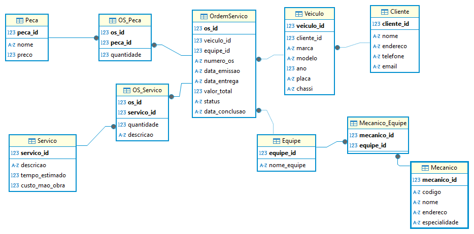

# Projeto Conceitual de Banco de Dados – Oficina Mecânica

## Descrição do Projeto

Este projeto visa desenvolver um **Sistema de Controle e Gerenciamento de Execução de Ordens de Serviço** para uma oficina mecânica. O sistema tem como objetivo otimizar o fluxo de trabalho, desde a entrada dos veículos na oficina até a conclusão dos serviços, garantindo eficiência, transparência e satisfação dos clientes.

## Objetivos

- **Gestão de Clientes e Veículos:** Registrar e gerenciar informações dos clientes e seus respectivos veículos.
- **Gestão de Equipes de Mecânicos:** Alocar veículos a equipes específicas de mecânicos com base em suas especialidades.
- **Gerenciamento de Ordens de Serviço (OS):** Criar, acompanhar e finalizar ordens de serviço, incluindo serviços executados e peças utilizadas.
- **Cálculo de Custos:** Estimar o valor total dos serviços com base na mão-de-obra e no custo das peças.
- **Autorização e Execução de Serviços:** Permitir que os clientes autorizem a execução dos serviços propostos e gerenciar a execução por parte das equipes.
- **Monitoramento de Status:** Acompanhar o status das ordens de serviço desde a emissão até a conclusão.

## Funcionalidades Principais

### 1. Gestão de Clientes e Veículos

- **Cadastro de Clientes:**
  - Informações pessoais como nome, endereço, telefone e email.
- **Cadastro de Veículos:**
  - Detalhes do veículo como marca, modelo, ano, placa e chassi.
  - Associação de cada veículo a um cliente específico.

### 2. Gestão de Equipes de Mecânicos

- **Cadastro de Mecânicos:**
  - Informações como código, nome, endereço e especialidade.
- **Formação de Equipes:**
  - Agrupamento de mecânicos em equipes para alocação de serviços.
  - Cada veículo é designado a uma equipe específica.

### 3. Gerenciamento de Ordens de Serviço (OS)

- **Criação de OS:**
  - Número da OS, data de emissão, data prevista para entrega, status e valor total.
  - Identificação dos serviços a serem executados e peças necessárias.
- **Acompanhamento de OS:**
  - Atualização do status da OS (e.g., Em andamento, Concluída, Cancelada).
  - Registro da data de conclusão dos trabalhos.
- **Autorização de Serviços:**
  - Envio de proposta ao cliente para aprovação dos serviços e custos.

### 4. Cálculo de Custos

- **Mão-de-Obra:**
  - Consulta a uma tabela de referência de mão-de-obra para determinar o custo de cada serviço.
- **Peças:**
  - Cálculo do custo das peças utilizadas em cada serviço.
- **Valor Total da OS:**
  - Soma dos custos de mão-de-obra e peças para determinar o valor total da ordem de serviço.

### 5. Monitoramento e Relatórios

- **Status das Ordens de Serviço:**
  - Visualização em tempo real do status das OS.
- **Relatórios Gerenciais:**
  - Geração de relatórios sobre desempenho das equipes, custos e satisfação dos clientes.

## Modelo Conceitual

O modelo conceitual do sistema está estruturado com as seguintes entidades e relacionamentos:

### Entidades e Atributos

1. **Cliente**
   - `cliente_id` (PK): Identificador único do cliente.
   - `nome`: Nome completo do cliente.
   - `endereco`: Endereço residencial.
   - `telefone`: Número de telefone.
   - `email`: Endereço de email.

2. **Veiculo**
   - `veiculo_id` (PK): Identificador único do veículo.
   - `cliente_id` (FK): Referência ao cliente proprietário.
   - `marca`: Marca do veículo.
   - `modelo`: Modelo do veículo.
   - `ano`: Ano de fabricação.
   - `placa`: Placa do veículo.
   - `chassi`: Número do chassi.

3. **Mecanico**
   - `mecanico_id` (PK): Identificador único do mecânico.
   - `codigo`: Código de identificação do mecânico.
   - `nome`: Nome completo do mecânico.
   - `endereco`: Endereço residencial.
   - `especialidade`: Área de especialização (e.g., elétrica, mecânica geral).

4. **Equipe**
   - `equipe_id` (PK): Identificador único da equipe.
   - `nome_equipe`: Nome da equipe.

5. **Mecanico_Equipe**
   - `mecanico_id` (FK): Referência ao mecânico.
   - `equipe_id` (FK): Referência à equipe.
   
6. **OrdemServico (OS)**
   - `os_id` (PK): Identificador único da ordem de serviço.
   - `veiculo_id` (FK): Referência ao veículo.
   - `equipe_id` (FK): Referência à equipe designada.
   - `numero_os`: Número da ordem de serviço.
   - `data_emissao`: Data de emissão da OS.
   - `data_entrega`: Data prevista para entrega.
   - `valor_total`: Valor total da OS.
   - `status`: Status atual da OS (e.g., Pendente, Em andamento, Concluída, Cancelada).
   - `data_conclusao`: Data de conclusão dos trabalhos.

7. **Servico**
   - `servico_id` (PK): Identificador único do serviço.
   - `descricao`: Descrição detalhada do serviço.
   - `tempo_estimado`: Tempo estimado para execução (em horas).
   - `custo_mao_obra`: Custo da mão-de-obra para o serviço.

8. **Peca**
   - `peca_id` (PK): Identificador único da peça.
   - `nome`: Nome da peça.
   - `preco`: Preço da peça.

9. **OS_Servico**
   - `os_id` (FK): Referência à ordem de serviço.
   - `servico_id` (FK): Referência ao serviço.
   - `quantidade`: Quantidade de serviços executados.
   - `descricao`: Descrição adicional (se necessário).

10. **OS_Peca**
    - `os_id` (FK): Referência à ordem de serviço.
    - `peca_id` (FK): Referência à peça.
    - `quantidade`: Quantidade de peças utilizadas.

### Relacionamentos

1. **Cliente - Veiculo**
   - **Relação:** `Cliente` possui **1:N** com `Veiculo`.
   - **Descrição:** Cada cliente pode possuir múltiplos veículos.

2. **Mecanico - Equipe**
   - **Relação:** `Mecanico` participa de **N:M** com `Equipe` através de `Mecanico_Equipe`.
   - **Descrição:** Cada mecânico pode pertencer a múltiplas equipes e cada equipe pode ter múltiplos mecânicos.

3. **Equipe - OrdemServico (OS)**
   - **Relação:** `Equipe` possui **1:N** com `OrdemServico`.
   - **Descrição:** Cada equipe pode ser responsável por múltiplas ordens de serviço.

4. **Veiculo - OrdemServico (OS)**
   - **Relação:** `Veiculo` possui **1:N** com `OrdemServico`.
   - **Descrição:** Cada veículo pode ter múltiplas ordens de serviço ao longo do tempo.

5. **OrdemServico (OS) - Servico**
   - **Relação:** `OrdemServico` possui **N:M** com `Servico` através de `OS_Servico`.
   - **Descrição:** Cada ordem de serviço pode incluir múltiplos serviços, e cada serviço pode ser parte de múltiplas ordens.

6. **OrdemServico (OS) - Peca**
   - **Relação:** `OrdemServico` possui **N:M** com `Peca` através de `OS_Peca`.
   - **Descrição:** Cada ordem de serviço pode incluir múltiplas peças, e cada peça pode ser utilizada em múltiplas ordens.

### Modelo ER (Diagrama Conceitual)

**Descrição:** Este diagrama visualiza as relações entre as entidades do sistema de controle e gerenciamento de ordens de serviço na oficina mecânica, facilitando a compreensão e implementação no banco de dados.

