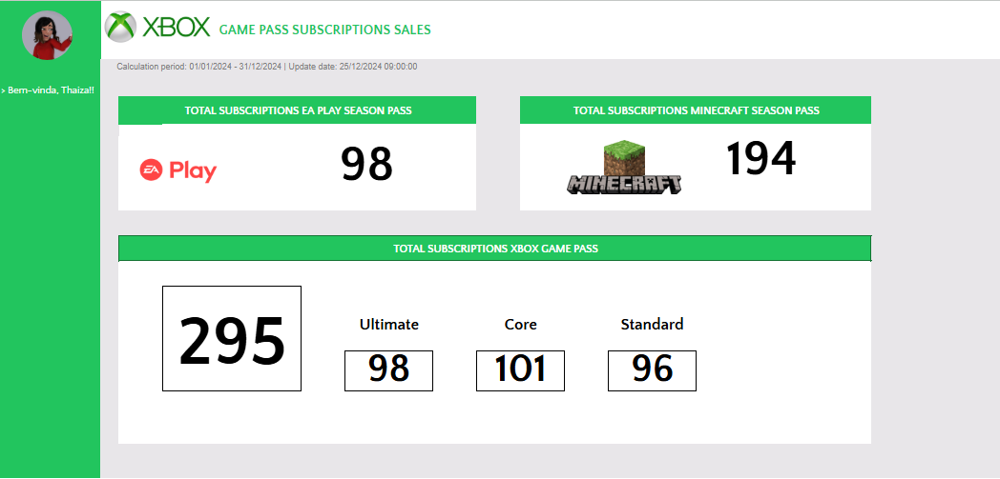

# Criando um Dashboard de Vendas do Xbox com Excel

## Descrição do Projeto

Este projeto tem como objetivo criar um **Dashboard de Vendas do Xbox** utilizando o Microsoft Excel. O dashboard foi desenvolvido para transformar dados brutos de assinaturas em visualizações claras e informativas, facilitando a análise do desempenho das vendas e auxiliando na tomada de decisões estratégicas baseadas em dados.

## Objetivos

- **Organização de Dados:** Estruturar e limpar os dados de assinaturas para garantir sua precisão e usabilidade.
- **Visualização de Dados:** Criar gráficos e tabelas dinâmicas que representem o desempenho das assinaturas de forma visualmente atraente e fácil de interpretar.
- **Análise de Desempenho:** Destacar as métricas de assinaturas para EA Play Season Pass, Minecraft Season Pass e Xbox Game Pass.
- **Tomada de Decisões:** Fornecer informações valiosas que apoiem decisões estratégicas para melhorar as vendas e a satisfação do cliente.

## Dados Utilizados

Os dados utilizados neste projeto representam as assinaturas dos diferentes passes de jogos do Xbox. As principais informações incluídas nos dados são:

| **Coluna**                  | **Descrição**                                       |
|-----------------------------|-----------------------------------------------------|
| **ID**                      | Identificador único da assinatura.                 |
| **Name**                    | Nome do assinante.                                  |
| **Plan**                    | Plano de assinatura escolhido (Ultimate, Core, Standard).                      |
| **Start Date**              | Data de início da assinatura.                       |
| **Auto Renewal**            | Indicação se a assinatura é renovação automática.   |
| **Subscription Price**      | Preço da assinatura.                                 |
| **Subscription Type**       | Período de assinatura (mensal, anual, quadrimestre).       |
| **EA Play Season Pass**     | Número de assinaturas do EA Play Season Pass.        |
| **EA Play Season Pass Price** | Preço por unidade do EA Play Season Pass.         |
| **Minecraft Season Pass**   | Número de assinaturas do Minecraft Season Pass.      |
| **Minecraft Season Pass Price** | Preço por unidade do Minecraft Season Pass.    |
| **Coupon Value**            | Valor de descontos aplicados através de cupons.      |
| **Total Value**             | Valor total da assinatura após descontos.            |

**Observação:** Os dados utilizados são fictícios e foram criados para fins de demonstração.

## Funcionalidades do Dashboard

- **Total Subscriptions EA Play Season Pass:** Monitoramento do número total de assinaturas do EA Play Season Pass.
- **Total Subscriptions Minecraft Season Pass:** Monitoramento do número total de assinaturas do Minecraft Season Pass.
- **Total Subscriptions Xbox Game Pass:** Monitoramento do número total de assinaturas do Xbox Game Pass.

## Tecnologias Utilizadas

- **Microsoft Excel:** Utilizado para a organização de dados, criação de tabelas dinâmicas e desenvolvimento do dashboard.
- **Power Query:** Ferramenta do Excel utilizada para a importação e limpeza dos dados.
- **Power Pivot:** Utilizado para modelagem de dados e criação de relações entre tabelas.
- **Gráficos e Tabelas Dinâmicas:** Para a visualização interativa e dinâmica dos dados.

## Visualização do Dashboard

## Acesso ao dataframe e dashboard original

[✅ Download o Dashboard em Excel](projeto3/Dados.xlsx)
